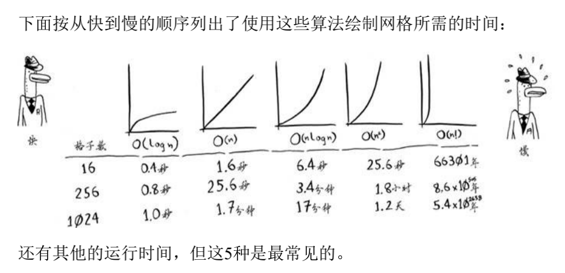

# 1. 大O表示法

- [1. 大O表示法](#1-大o表示法)
  - [简介](#简介)
  - [运算速度](#运算速度)
  - [介绍](#介绍)
  - [练习](#练习)
    - [练习答案(自己蒙的)](#练习答案自己蒙的)

## 简介

因此，随着列表的增长，二分查找的速度比简单查找快得多。Bob以为二分查找速度为简单查找的15倍，这不对：列表包含10亿个元素时，为3300万倍。有鉴于此，仅知道算法需 要多长时间才能运行完毕还不够，还需知道运行时间如何随列表增长而增加。这正是大O表示法的用武之地。

## 运算速度

常见的几种

- O (log n)，也叫对数时间 ，这样的算法包括二分查找。 
- O (n)，也叫线性时间 ，这样的算法包括简单查找。 
- O (n * log n )，这样的算法包括第4章将介绍的快速排序——一种速 度较快的排序算法。 
- O (n ** 2 )，这样的算法包括第2章将介绍的选择排序——一种速度较 慢的排序算法。 
- O (n! )，这样的算法包括接下来将介绍的旅行商问题的解决方案 ——一种非常慢的算法。

## 介绍

- 算法的速度指的并非时间，而是操作数的增速。
- 谈论算法的速度时，我们说的是随着输入的增加，其运行时间将以 什么样的速度增加。 
- 算法的运行时间用大O表示法表示。 
- O (log n )比O (n )快，当需要搜索的元素越多时，前者比后者快得 越多。

## 练习

1. 在电话簿中根据名字查找电话号码。
2. 在电话簿中根据电话号码找人。（提示：你必须查找整个电话 簿。）
3. 阅读电话簿中每个人的电话号码。
4. 阅读电话簿中姓名以A打头的人的电话号码。这个问题比较棘手， 它涉及第4章的概 念。答案可能让你感到惊讶！

### 练习答案(自己蒙的)

> 2021年04月30日15:36:17

1. O(n)
2. O(n)
3. O(n)
4. ???

<CommentService/>
