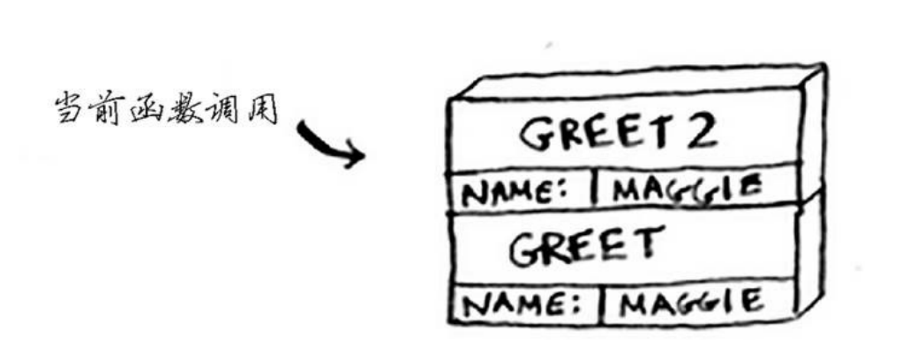

# 3.1栈

这一章有个重要的概念，调用栈(call stack)。

## 目录

- [3.1栈](#31栈)
  - [目录](#目录)
  - [调用栈](#调用栈)
  - [小结](#小结)

## 调用栈

## 小结

1. 递归指的是调用自己的函数。
2. 每个递归函数都有两个条件：基线条件和递归条件。
3. 栈有两种操作：压入和弹出。
4. 所有函数调用都进入调用栈。
5. 调用栈可能很长，这将占用大量的内存。

<CommentService/>
