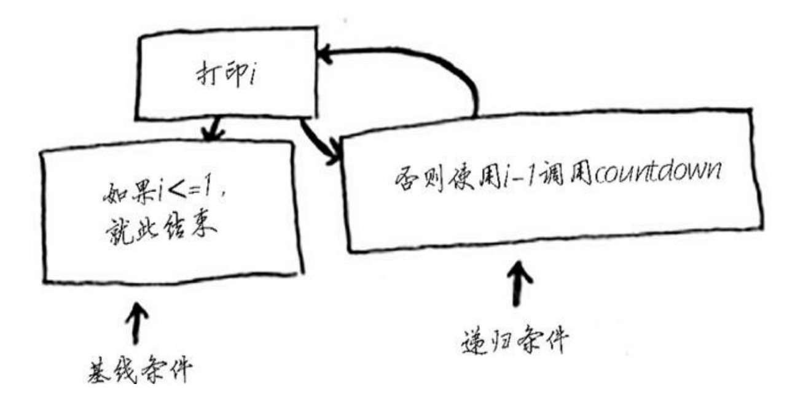

# 3. 递归

第三章

## 递归是什么

自己调用自己，一直到达到某个条件(基准条件)，然后就会开始逆推
递归->逆推

```python
    def a1(i):
        print(i)
        if i == 0:  # 到达0的时候就不在继续了
            return
        else:   # 递归条件
            a1(i-1)

    a1(10)
```

上面那个中，i==0就是基准条件
流程图：



<CommentService/>
