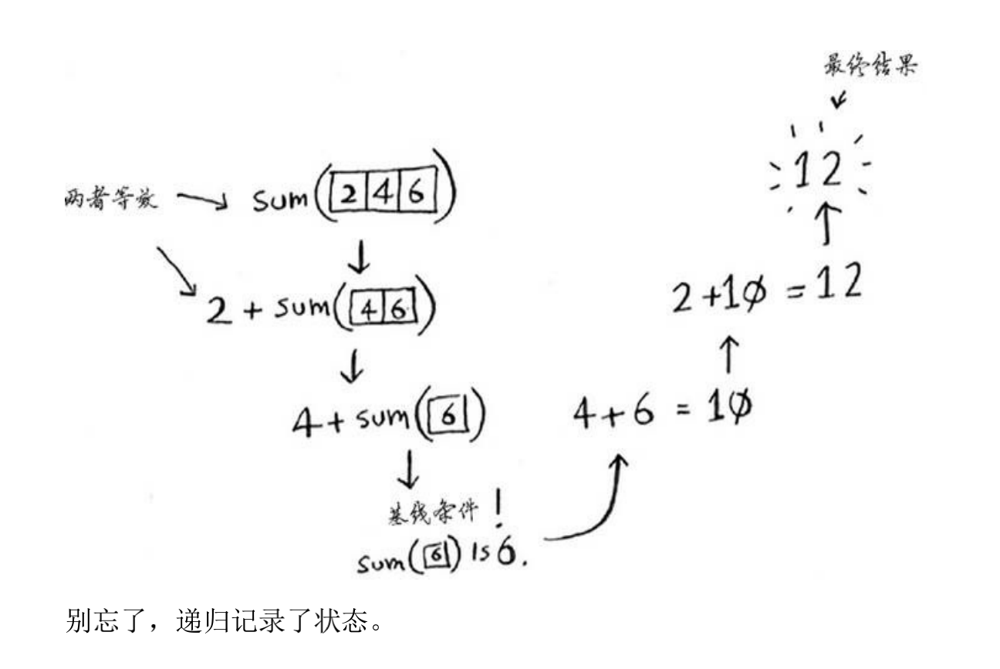
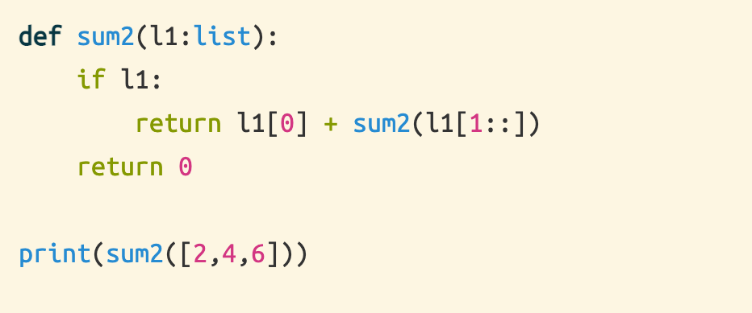

# 4.1 分而治之

## 目录

- [4.1 分而治之](#41-分而治之)
  - [目录](#目录)
  - [欧几里德算法(辗转相除法)](#欧几里德算法辗转相除法)
    - [递归求列表的和（仿写sum函数）](#递归求列表的和仿写sum函数)
  - [练习](#练习)

## 欧几里德算法(辗转相除法)

[可汗学校](https://www.khanacademy.org/computing/computer-science/ryptography/modarithmetic/a/the-euclidean-algorithm)

建议直接去百度百科，或者维基百科

### 递归求列表的和（仿写sum函数）

```python
def sum2(l1:list):
    if l1:
        return l1[0] + sum2(l1[1::])
    return 0

print(sum2([2,4,6]))
```




## 练习

1. 请编写前述sum 函数的代码。
2. 编写一个递归函数来计算列表包含的元素数
3. 找出列表中最大的数字。
4. 还记得第1章介绍的二分查找吗？它也是一种分而治之算法。你能找出二分查找算法的基线条件和递归条件吗？

<CommentService/>
