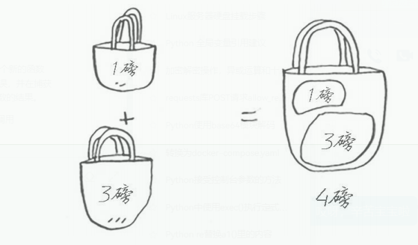
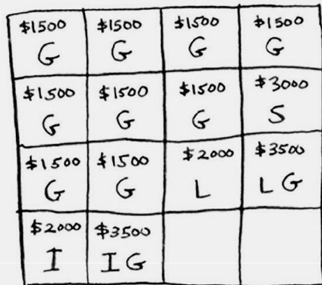

# 9.动态规划

> 2024-03-26 13:43:38

## toc

1. [9.动态规划](#9动态规划)
    1. [toc](#toc)
    2. [动态规划](#动态规划)
        1. [背包问题](#背包问题)
        2. [练习](#练习)
            1. [我的草稿](#我的草稿)
        3. [练习2](#练习2)
    3. [最长公共子串](#最长公共子串)

## 动态规划

动态规划先解决子问题，再逐步解决大问题。  (我感觉像是一种递归的感觉)



### 背包问题

| 物品名     | 重量 | 价值 |
| ---------- | ---- | ---- |
| 吉他       | 1g   | 1500 |
| 音响       | 4g   | 3000 |
| 笔记本电脑 | 3g   | 2000 |
| 手机       | 1g   | 2000 |



> 如果有多了一个 mp3，还装吗？？

| 物品名 | 重量 | 价值 |
| ------ | ---- | ---- |
| 手机   | 1g   | 1000 |

### 练习

假设你要去野营。你有一个容量为6磅的背包，需要决定该携带下
面的哪些东西。其中每样东西都有相应的价值，价值越大意味着越重
要：

| 物品 | 重量 | 价值 |
| ---- | ---- | ---- |
| 水   | 3磅  | 10   |
| 书   | 1磅  | 3    |
| 食物 | 2磅  | 9    |
| 夹克 | 2磅  | 5    |
| 相机 | 1磅  | 6    |

#### 我的草稿

```text

    0       0       0       0       0       0       
    3       3       3       3       3       3
    6       6       6       6       6       6
    0       5       5       5       5       5
    0       9       9       9       9       9
    0       0       10      10      10      10


    # 应该是25吧，晚点去找找答案啥的

    6       0       9        0       0      10   25

    0       0       10      10      19      25
```

草稿2

```text
    3       3       3       3       3       3
    6       6+3=9   9       9       9       9
    6       9(食)   9+6=15  15+3=18 18      18
    6       5  # 直接pass
    6       9       10      10+9    19+6    25+3
```

### 练习2

假设你要去伦敦度假，假期两天，但你想去游览的地方很多。你没法前
往每个地方游览，因此你列个单子

| 名称           | 时间  | 评分 |
| -------------- | ----- | ---- |
| 威斯敏斯特教堂 | 0.5天 | 7    |
| 环球剧场       | 0.5天 | 6    |
| 英国国家美术馆 | 1天   | 9    |
| 大英博物馆     | 2天   | 9    |
| 圣保罗大教堂   | 0.5天 | 8    |


```markdown
0.5     1       1.5     2

6       6       6       6
7       7       7       7
8       8       8       8
0       9       9+8=17  17+7=24
0       0       0       9   

6       6       6       6
7       7+6     13      13
8       8+7     15+6    21
0       9       9+8     17+7=24
0       0       0       9

7       7       7       7
7       13(6+7) 13      13          2格最大是13
7       13      16[^1]  16+6=22     3格目前最大是16
7       13      16      22          不如上面的那个划算(9 < 22) 上面那个2天能有22分，而这个2天只有9分
8       15(8+7) 21[^2]  24(15+9)    

[^1]: 这里(9+7就大于了6+7,)
[^2]: 9+8=17  15+6=21
```

## 最长公共子串

动态规划往往都会用到网格

绘制表格的问题

- 单元格中的值是什么？
- 如何将这个问题划分为子问题？
- 网格的坐标轴是什么？

<CommentService/>
