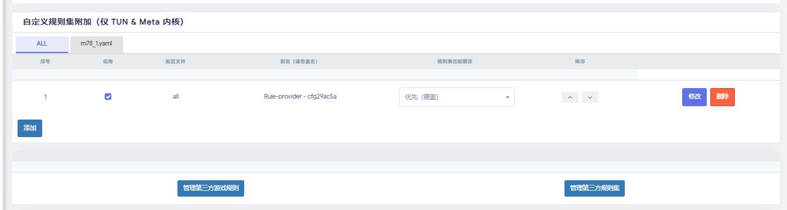

# 3-如何让域名走代理或走直连

## toc

1. [3-如何让域名走代理或走直连](#3-如何让域名走代理或走直连)
    1. [toc](#toc)
    2. [简单操作](#简单操作)
        1. [先写配置](#先写配置)
        2. [使用配置](#使用配置)
        3. [刷新规则](#刷新规则)

## 简单操作

### 先写配置

> 这里似乎也可以用网上的文件(或许我可以用我自己服务器的文件或者配置)
> 我这里教程用的是本地配置

关于openclash如何让部分域名走直连

clash后台>配置管理>规则集文件列表>pscly>修改

clash后台>配置管理>规则集文件列表>新建文件

文件内容
```text
pscly.cn
*.pscly.cn
pscly.icu
*.pscly.icu

```

### 使用配置

clash后台>规则附加>自定义规则集附加（仅 TUN & Meta 内核）>选择需要覆盖的订阅(也可以是所有(就是all))



如果用的是 本地配置 (上面的[教程](#先写配置))

那么规格集类型就该选用 file

规则格式（TUN&Meta 内核） 选择 text

指定策略组:  

| 模式   | 意思 |
| ------ | ---- |
| DIRECT | 直连 |
| Reject | 禁止访问 |

然后保存

### 刷新规则 

我们后续可以继续修改规则，修改完毕后就来这里刷新一下

[这里](http://192.168.3.1:9090/ui/yacd/#/rules)


<CommentService/>
