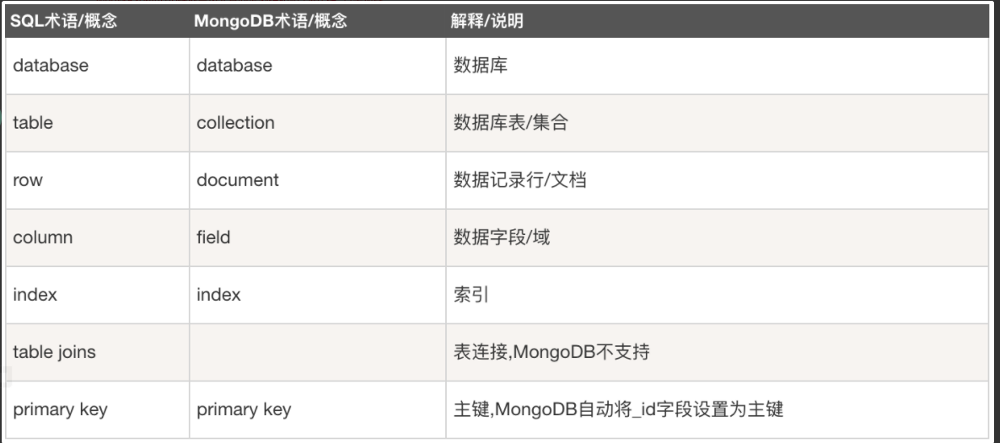

# 1.1MongoDB简介

MongoDB是什么？
是(面向文档)(非关系型)数据库👍🏻

## 目录

- [1.1MongoDB简介](#11mongodb简介)
  - [目录](#目录)
  - [端口号](#端口号)
  - [特性](#特性)
  - [mongo 基础知识](#mongo-基础知识)
  - [安装](#安装)

## 端口号

27017

## 特性

1. 易用性

    > ```
    > MongoDB是一个面向文档（document-oriented）的数据库，而不是关系型数据库。
    > 不采用关系型主要是为了获得更好得扩展性。当然还有一些其他好处，与关系数据库相比，面向文档的数据库不再有“行“（row）的概念取而代之的是更为灵活的“文档”（document）模型。
    > 通过在文档中嵌入文档和数组，面向文档的方法能够仅使用一条记录来表现复杂的层级关系，这与现代的面向对象语言的开发者对数据的看法一致。
    > 另外，不再有预定义模式（predefined schema）：文档的键（key）和值（value）不再是固定的类型和大小。由于没有固定的模式，根据需要添加或删除字段变得更容易了。通常由于开发者能够进行快速迭代，所以开发进程得以加快。而且，实验更容易进行。开发者能尝试大量的数据模型，从中选一个最好的。
    > ```
    >
    > mongodb: 非关系型数据库(放硬盘上的)
    >
    > 他是面向文档的数据库，而不是关系型数据库
    >
    > redis是存在内存上的
    >
    > 非关系型数据库:
    > 表和表之间没有关联
    >
    > 似乎是可以像json那样存数据，所以我们取出数据也是十分的方便

2. 易扩展性
    > 应用程序数据集的大小正在以不可思议的速度增长。随着可用带宽的增长和存储器价格的下降，即使是一个小规模的应用程序，需要存储的数据量也可能大的惊人，甚至超出了很多数据库的处理能力。过去非常罕见的T级数据，现在已经是司空见惯了。
    > 由于需要存储的数据量不断增长，开发者面临一个问题：应该如何扩展数据库，分为纵向扩展和横向扩展，纵向扩展是最省力的做法，但缺点是大型机一般都非常贵，而且当数据量达到机器的物理极限时，花再多的钱也买不到更强的机器了，此时选择横向扩展更为合适，但横向扩展带来的另外一个问题就是需要管理的机器太多。
    > MongoDB的设计采用横向扩展。面向文档的数据模型使它能很容易地在多台服务器之间进行数据分割。MongoDB能够自动处理跨集群的数据和负载，自动重新分配文档，以及将用户的请求路由到正确的机器上。这样，开发者能够集中精力编写应用程序，而不需要考虑如何扩展的问题。如果一个集群需要更大的容量，只需要向集群添加新服务器，MongoDB就会自动将现有的数据向新服务器传送

3. 丰富的功能
    > MongoDB作为一款通用型数据库，除了能够创建、读取、更新和删除数据之外，还提供了一系列不断扩展的独特功能
    1. 索引
        支持通用二级索引，允许多种快速查询，且提供唯一索引、复合索引、地理空间索引、全文索引

    2. 聚合
        支持聚合管道，用户能通过简单的片段创建复杂的集合，并通过数据库自动优化

    3. 特殊的集合类型
        支持存在时间有限的集合，适用于那些将在某个时刻过期的数据，如会话session。类似地，MongoDB也支持固定大小的集合，用于保存近期数据，如日志

    4. 文件存储
        支持一种非常易用的协议，用于存储大文件和文件元数据。MongoDB并不具备一些在关系型数据库中很普遍的功能，如链接join和复杂的多行事务。省略这些的功能是处于架构上的考虑，或者说为了得到更好的扩展性，因为在分布式系统中这两个功能难以高效地实现

4. 卓越的性能

## mongo 基础知识



1. 文档是MongoDB的核心概念。文档就是键值对的一个有序集{'msg':'hello','foo':3}。类似于python中的有序字典。

## 安装

[安装](2.0安装.md)

<CommentService/>
