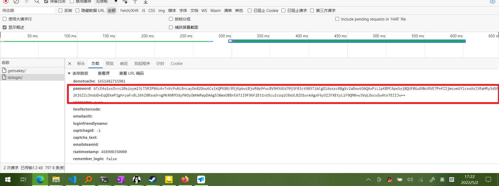
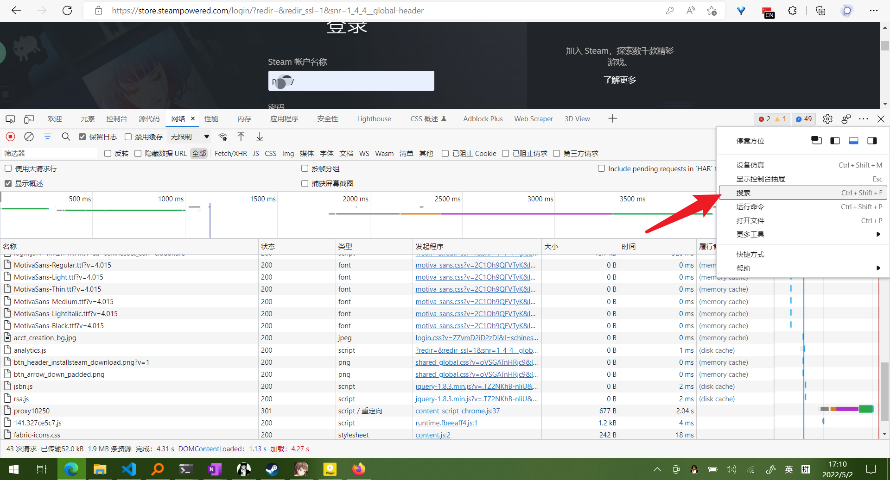
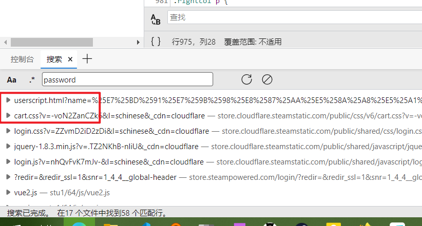
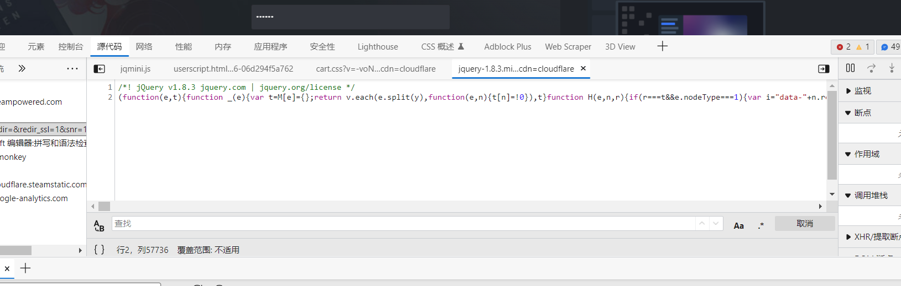
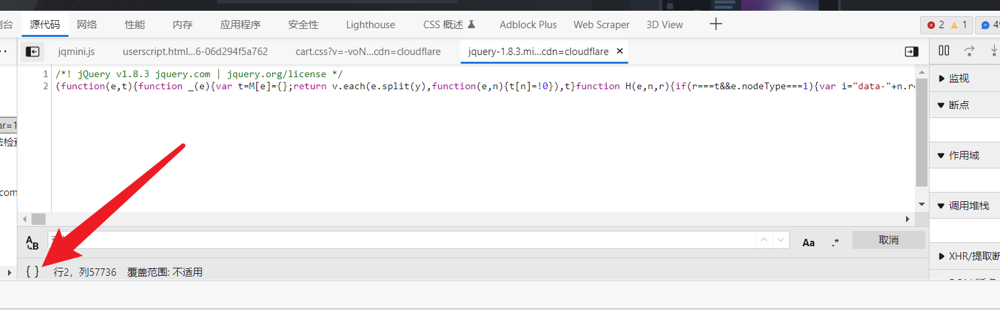
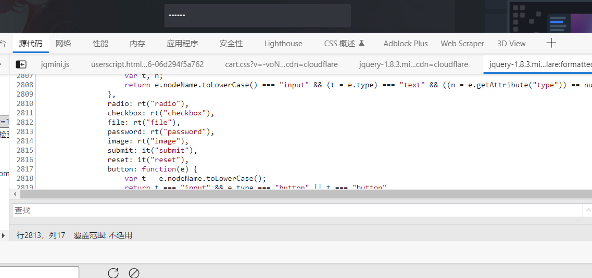
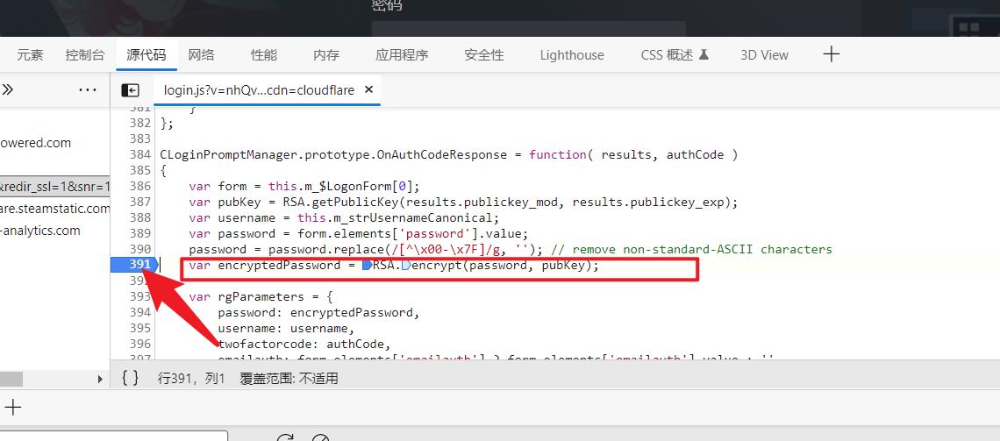
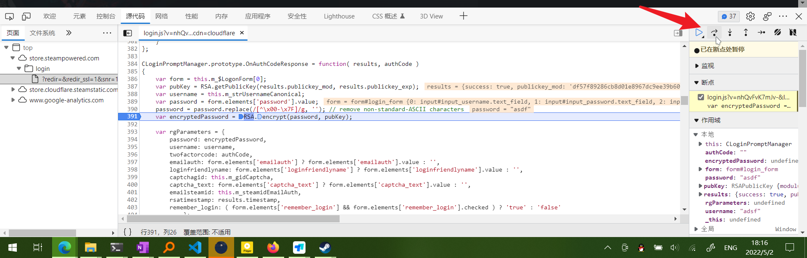

# 10.浏览器js断点解密

## 案例

### 1 查看steam登录时前端密码加密

这里密码被加密了，我们可以通过js获取到密码，然后自己解密

1. 查询密码相关的js文件
   1. 如何拿到js文件?
      1. 使用浏览器抓包工具刷新一下页面拿到所有的js文件
      2. 然后使用全局搜索password查找操作了passwrod的js文件
         1. 
      3. 把能收的收起来，我们只需要看js文件就行了
         1. 
      4. 遇到这种一行的代码
         1. 
         2. 格式化一下
         3. 
         4. 就好了
         5. 
      5. 找到可疑地方的代码,在左边打断点
         1. 
      6. 再次点击登录,（就会在断点位置停下来）
         1. 

<CommentService/>
