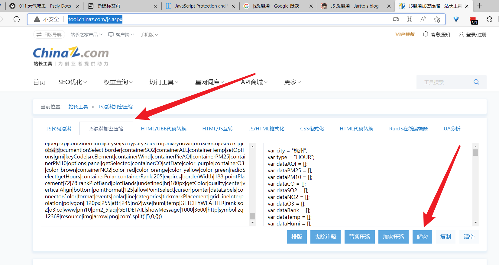

# 011.天气爬虫

## js混淆

解决方法: 打开js代码反混淆的网站
> 反混淆网站: http://tool.chinaz.com/js.aspx, 这里还有ua查询工具
> 

## js逆向 PyExecJs

[看这里](./012.PyexecJS.md)

## 流程

1. 网站设置了禁用开发者工具(禁止f12, 卡循环debuger，检测到打开开发者工具就会给你一个空页面，)
   1. 绕过方法
      1. 使用ctrl+shift+i
      2. 将卡debuger处跳过
      3. 将调试工具新开一个页面
   2. 查看网页ajax，发现是加密的，需要研究他加密的算法
      1. 使用firefox，因为他能查看一个标签所绑定的事件
      2. 找到查询事件，找到他点击调用的函数，函数是被js混淆了的，需要反混淆一下
      3. 找到点击事件，查看他内部哪里用了ajax，没有找到，但是找到他内部用了两个函数，函数内部有封装方法进行ajax，不过在发送ajax前他将数据进行了加密，这里我就将加密部分的js代码拷贝到了本地，让本地使用PyexecJS进行调用，
         1. 

<CommentService/>
