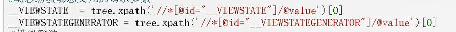
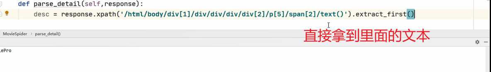

# 015.

1. from lxml import etree
2. from parsel import Selector

## 方法1 lxml

### 代码

```python
from lxml import etree

# tree = etree.parse('./text.html')
tree = etree.HTML('./text.html')

tree.xpath('/html/title')[0]
```



拿到标签中的文本(这里使用的scrapy的xpath)



## 方法2 推荐: from parsel import Selector

### 代码

```python
from parsel import Selector
html = Selector(res.text)
image_url = html.xpath('//*[@id="J_goodsList"]/ul').extract_first()
```

<CommentService/>
