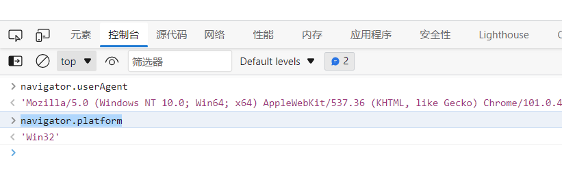

# 002.selenium特征识别

## 特征识别 window.navigator.webdriver属性值修改

### 代码

```python
# 编写修改navigator.webdriver值的JavaScript代码
script = 'Object.defineProperty(navigator, "webdriver", {get: () => false,});'
# 浏览器运行JavaScript代码，将属性值修改为false
browser.execute_script(script)
```

### 完整代码

```python
from selenium.webdriver import Edge
import time

browser = Edge(executable_path='msedgedriver.exe')
browser.get('http://www.porters.vip/features/webdriver.html')
# 编写修改navigator.webdriver值的JavaScript代码
script = 'Object.defineProperty(navigator, "webdriver", {get: () => false,});'
# 浏览器运行JavaScript代码，将属性值修改为false
browser.execute_script(script)
time.sleep(0.1)
# 定位按钮并点击
# browser.find_element_by_css_selector('.btn.btn-primary.btn-lg').click()
browser.find_element_by_xpath('//*[@id="article"]/button').click()
# 定位到文章内容元素
elements = browser.find_element_by_css_selector('#content')
time.sleep(0.1)
# 打印文章内容
print(elements.text)
# 关闭浏览器
browser.close()
```

## 浏览器特征识别2

> navigator.platform
> navigator.userAgent



<CommentService/>
