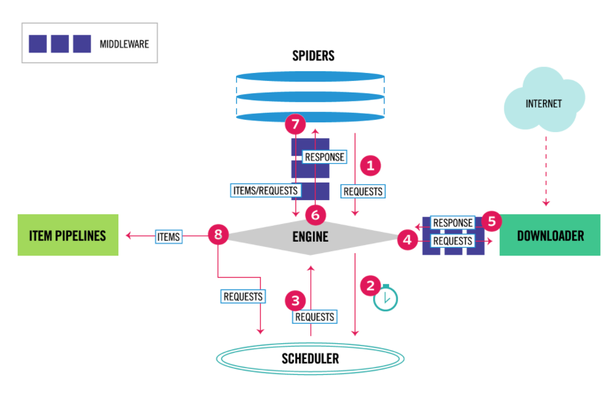
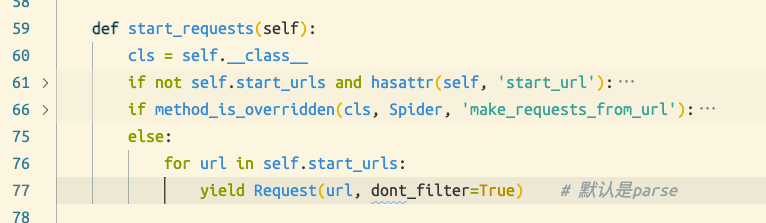

# 01.0 开始

[参考博客](https://www.cnblogs.com/xiaoyuanqujing/protected/articles/11805810.html)



## 目录

- [01.0 开始](#010-开始)
  - [目录](#目录)
  - [对比requests](#对比requests)
  - [安装](#安装)
  - [新建项目(爬虫)](#新建项目爬虫)
    - [项目目录简介](#项目目录简介)
  - [命令行工具](#命令行工具)
  - [运行爬虫](#运行爬虫)
    - [文件方法](#文件方法)
  - [爬虫运行流程](#爬虫运行流程)
    - [爬虫入口](#爬虫入口)

## 对比requests

- 优点
    1. 如果是要搞异步操作，scrapy更适合
- 缺点
    1. 他的灵活度不如requests
        1. 要做js逆向的操作
        2. 动态加载数据捕获的操作
   
输入scrapy也能做，但是requests会更加灵活
而且scrapy不太好打包，requests可以


## 安装

[如何安装scrapy](./01.1安装.md)

## 新建项目(爬虫)

[详细命令](./01.2命令行工具.md)

    # 新建项目
    scrapy startproject myscrapy

    # 新建爬虫(你新建好了项目的时候他就会提醒你去新建爬虫)
    scrapy genspider 爬虫名 要爬取的域名
    # 例如(我爬我自己)
    scrpay genspider pscly pscly.cn

### 项目目录简介

[项目目录简介](./01.3项目目录介绍.md)

```
├── myscrapy
│   ├── __init__.py
│   ├── items.py
│   ├── middlewares.py
│   ├── pipelines.py
│   ├── settings.py
│   └── spiders   # 放要写的爬虫
│       └── __init__.py
└── scrapy.cfg  # 项目部署有关的文件
```

## 命令行工具

[命令行工具](./01.2命令行工具.md)

## 运行爬虫

> 运行之前最好得去修改下配置文件
> [配置文件设置](./01.4%E8%AE%BE%E7%BD%AE%E6%96%87%E4%BB%B6.md)
> 1. 设置ua
> 2. 关闭robots.txt
> 3. 指定日志等级

1. 首先得新建的有爬虫(scrapy genspider 的那个)
2. 然后将settings里面的ROBOTSTXT_OBEY设置为False，否则会遵循爬虫协议，很多东西都无法爬取
3. 运行爬虫: `scrapy crawl cnblogs`  --nolog可以让爬虫不打印日志(不推荐)

```bash
# scrapy crawl 爬虫名
scrapy crawl cnblogs
scrapy crawl cnblogs --nolong   # 不打印日志
```

如果加了--nolog 就不会显示报错的信息，因为他是多线程异步的

### 文件方法

在爬虫的根目录创建一个mian.py

```python
from scrapy.cmdline import execute
execute(['scrapy', 'crawl', 'cnblogs'])
# execute(['scrapy', 'crawl', 'cnblogs','--nolog'])  # 如果要添加参数
```

## 爬虫运行流程

### 爬虫入口



<CommentService/>
