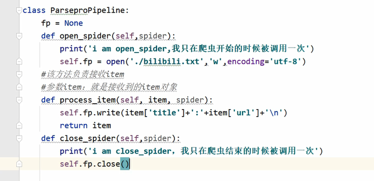

# 3.0数据持久化存储

## 方式1

> 基于终端指令的持久化存储

只可以将parse方法的返回值进行本地指定后缀文件的存储(json, csv, ....)

scarpy crawl 爬虫名 -o 文件.json

`scarpy crawl xxx -o xxx.json`

## 方式2

> 基于管道的持久化存储

### 管道

pipelines.py 中他定义了一个管道类,类中有个方法process_item,用这个方法就能帮助我们进行持久化存储 
这个方法的返回值就是要存储的数据

1. 在爬虫中进行数据解析
2. 在items.py中定义相关的字段
    1. 解析出什么字段，就定义什么字段
        ```python
        url = scrapy.Field()
        title = scrapy.Field()
        ```
3. 将爬虫文件中解析出的内容存储到items类型的对象中
    1. parse中
        ```python
        item = ParseproItem()
        item['url'] = response.url
        item['title'] = response.xpath('//title/text()').extract_first()
        ```
4. 将item对象提交给管道
    1. parse中(接上面的)
        ```python
        yield item
        ```
5. 在管道中接受item且对其进行任意形式的持久化存储操作
    1. pipelines.py中
        ```python
        class ParseproPipeline(object):
            # 该方法负责接受item
            # 参数item就是上面发过来的item对象
            def process_item(self, item, spider):
                return item
        ```
6. 在爬虫中指定开启管道机制
    1. settings.py中
        ```python
        # 300表示优先级，数字越小优先级越高,范围是0-1000
        ITEM_PIPELINES = {
            'parsepro.pipelines.ParseproPipeline': 300,
        }
        ```
7. 进行持久化
    1. 
    2. def open_spider(self, spider) 是爬虫开始的时候执行一下
    3. def close_spider(self, spider) 是爬虫结束的时候执行一下

### 定义多个管道类

将一个数据存储到多个平台中

就只需要配置settings.py中的ITEM_PIPELINES, 并且设置优先级

**在爬虫文件parse中的yeild item是将item提交给了优先级最高的管道**

在管道类的process_item中的return 将item返回给了下一个优先级最高的管道类


<CommentService/>
