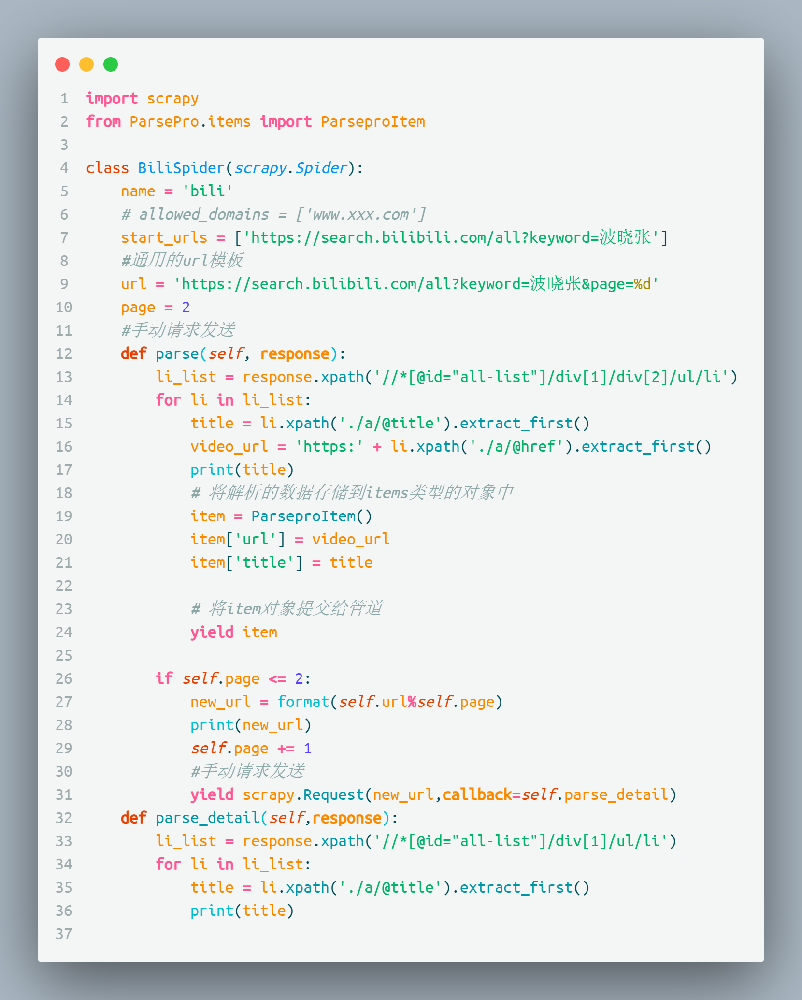

# 04.0请求

## 如何手动发送请求

scrapy一般都是开始的时候跑一下start_urls里面的url
但是如果要在代码中手动发送的话就要参考下面的东西了

通常不用 scrapy 发 post 请求

- get:yield scrapy.Request(new_url,callback=self.parse_detail)  # callback是回调参数，通常是parse,但是有的网页他第一页和第二页数据路径不一样
- post:yield scrapy.FormRequest(url,callback,formdata)



## 请求传参


深入爬取: 爬取的数据没有在同一个页面中

这种情况下scrapy就不如requests了，爬的时候倒还好，但是持久化存储的时候就不太好操作了


### 传参

``` python
yield scrapy.Request(url,callback=self.parse_2,meta={'item':item})
```

### 接受参数

``` python
def parse_2(self,response):
    item = response.meta['item']
    ...
```

<CommentService/>
