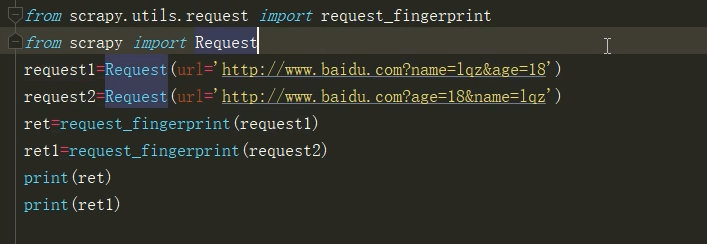

# 数据去重

他自己是有去重的规则，你可以去看看他的源代码文件(scrapy/settings/default_settings.py#DUPEFILTER_CLASS)
自己的去重规则可以连接成持久化的那种，就会更加的方便

1. 去重算法
    布隆过滤器
    BloomFilter算法
2. 缓存雪崩，缓存穿透

## 目录

- [数据去重](#数据去重)
  - [目录](#目录)
  - [自己写去重](#自己写去重)
    - [可能出现的问题](#可能出现的问题)
    - [scrapy处理我们可能出现的问题](#scrapy处理我们可能出现的问题)
  - [修改设置](#修改设置)
  - [如果不想去重](#如果不想去重)

## 自己写去重

### 可能出现的问题

1. 保存到集合中
2. 保存MD5，
3. 地址的get请求可能一样，但顺序不同MD5就会不同

### scrapy处理我们可能出现的问题

处理问题3:

## 修改设置

settings中添加一个字段

    DUPEFILTER_CLASS = 'scrapy.dupefilter.RFPDupeFilter' #默认的去重规则帮我们去重，去重规则在内存中
    DUPEFILTER_CLASS = '自己的规则' #默认的去重规则帮我们去重，去重规则在内存中
    DUPEFILTER_DEBUG = False

## 如果不想去重

Request中的参数中设置 Request(dont_filter=True)

<CommentService/>
