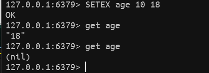
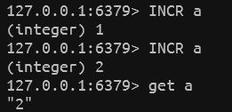

# 字符串类型使用

- [字符串类型使用](#字符串类型使用)
  - [使用](#使用)
  - [DEL key](#del-key)
    - [3 GETRANGE key start end](#3-getrange-key-start-end)
    - [8 SETEX key seconds value](#8-setex-key-seconds-value)
    - [12 MSET key value [key value ...\]](#12-mset-key-value-key-value-)
    - [6 MGET key1 [key2..\]](#6-mget-key1-key2)
    - [9 SETNX key value](#9-setnx-key-value)
    - [15 INCR key](#15-incr-key)
  - [常用命令](#常用命令)

> 参考 https://www.runoob.com/redis/redis-strings.html

| 序号 | 命令及描述                                                   |
| :--- | :----------------------------------------------------------- |
| 1    | [SET key value](https://www.runoob.com/redis/strings-set.html) 设置指定 key 的值。 |
| 2    | [GET key](https://www.runoob.com/redis/strings-get.html) 获取指定 key 的值。 |
| 3    | [GETRANGE key start end](https://www.runoob.com/redis/strings-getrange.html) 返回 key 中字符串值的子字符 |
| 4    | [GETSET key value](https://www.runoob.com/redis/strings-getset.html) 将给定 key 的值设为 value ，并返回 key 的旧值(old value)。 |
| 5    | [GETBIT key offset](https://www.runoob.com/redis/strings-getbit.html) 对 key 所储存的字符串值，获取指定偏移量上的位(bit)。 |
| 6    | [MGET key1 [key2..\]](https://www.runoob.com/redis/strings-mget.html) 获取所有(一个或多个)给定 key 的值。 |
| 7    | [SETBIT key offset value](https://www.runoob.com/redis/strings-setbit.html) 对 key 所储存的字符串值，设置或清除指定偏移量上的位(bit)。 |
| 8    | [SETEX key seconds value](https://www.runoob.com/redis/strings-setex.html) 将值 value 关联到 key ，并将 key 的过期时间设为 seconds (以秒为单位)。 |
| 9    | [SETNX key value](https://www.runoob.com/redis/strings-setnx.html) 只有在 key 不存在时设置 key 的值。 |
| 10   | [SETRANGE key offset value](https://www.runoob.com/redis/strings-setrange.html) 用 value 参数覆写给定 key 所储存的字符串值，从偏移量 offset 开始。 |
| 11   | [STRLEN key](https://www.runoob.com/redis/strings-strlen.html) 返回 key 所储存的字符串值的长度。 |
| 12   | [MSET key value [key value ...\]](https://www.runoob.com/redis/strings-mset.html) 同时设置一个或多个 key-value 对。 |
| 13   | [MSETNX key value [key value ...\]](https://www.runoob.com/redis/strings-msetnx.html) 同时设置一个或多个 key-value 对，当且仅当所有给定 key 都不存在。 |
| 14   | [PSETEX key milliseconds value](https://www.runoob.com/redis/strings-psetex.html) 这个命令和 SETEX 命令相似，但它以毫秒为单位设置 key 的生存时间，而不是像 SETEX 命令那样，以秒为单位。 |
| 15   | [INCR key](https://www.runoob.com/redis/strings-incr.html) 将 key 中储存的数字值增一。 |
| 16   | [INCRBY key increment](https://www.runoob.com/redis/strings-incrby.html) 将 key 所储存的值加上给定的增量值（increment） 。 |
| 17   | [INCRBYFLOAT key increment](https://www.runoob.com/redis/strings-incrbyfloat.html) 将 key 所储存的值加上给定的浮点增量值（increment） 。 |
| 18   | [DECR key](https://www.runoob.com/redis/strings-decr.html) 将 key 中储存的数字值减一。 |
| 19   | [DECRBY key decrement](https://www.runoob.com/redis/strings-decrby.html) key 所储存的值减去给定的减量值（decrement） 。 |
| 20   | [APPEND key value](https://www.runoob.com/redis/strings-append.html) 如果 key 已经存在并且是一个字符串， APPEND 命令将指定的 value 追加到该 key 原来值（value）的末尾。 |

## 使用

## DEL key 

> 删除一个或多个 key

### 3 GETRANGE key start end

> 取索引

### 8 SETEX key seconds value

> 设置值并且设置过期时间(秒)

### 12 MSET key value [key value ...\]

> 群增

### 6 MGET key1 [key2..\]

> 群取

### 9 SETNX key value

> 只有在 key 不存在时设置 key 的值
> 设置成功返回1，否则返回0

### 15 INCR key

> 将 key 中储存的(数字值)增一

## 常用命令

- set：key value
- get：key
- mset：k1 v1 k2 v2 ... kn vn
- mget：k1 k2 ... kn
- setex：key exp value

<CommentService/>
