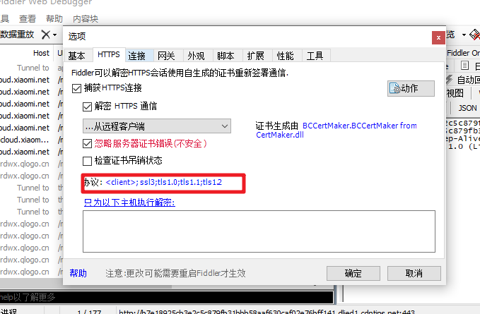
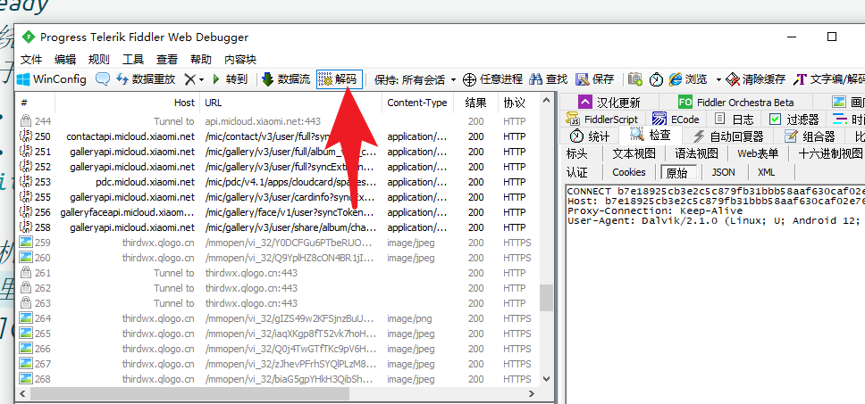

# 000.前置知识

1. trustmealready 
    1. 这个是绕过 SSL Pinning 模块，不然抓包会不正常
        1. 关于 SSL Pinning 
            1. 这个东西是防止中间人抓包攻击的东西，如果发现证书不正确，那就不发送数据
            2. [参考](https://www.infinisign.com/faq/what-is-ssl-pinning#)
    2. 地址[github](https://github.com/ViRb3/TrustMeAlready/releases)
2. fiddler
    1. 开启手机方面的协议设置
        1. 这里改弄的弄上，不然不能解密就很呆
        2.  
    2. 开启解码功能(不然有的时候是一堆乱码)
        1.  

<CommentService/>
