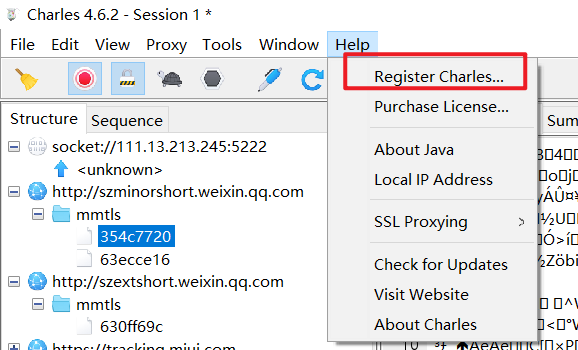
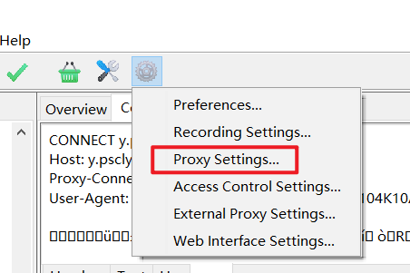
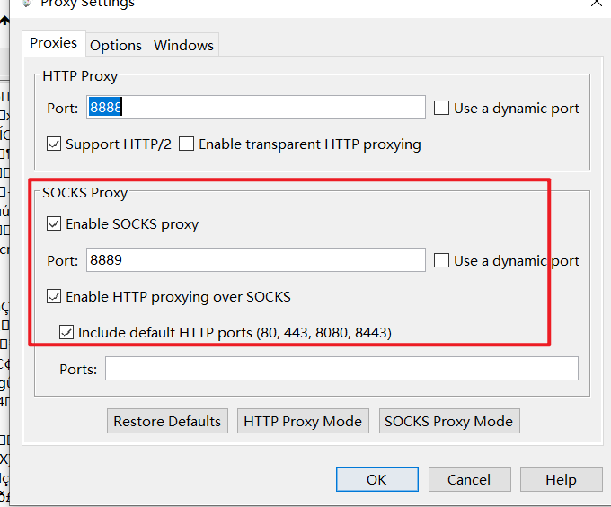
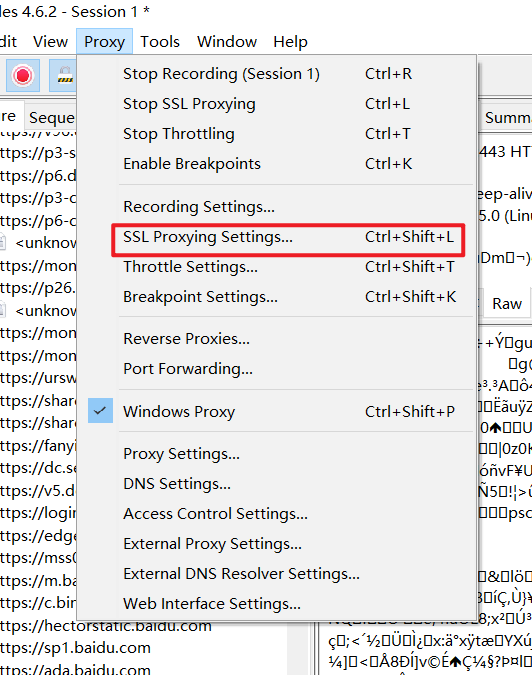
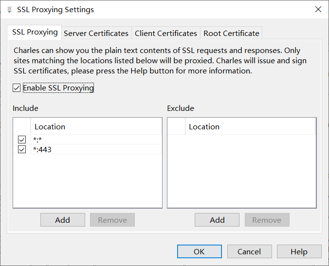
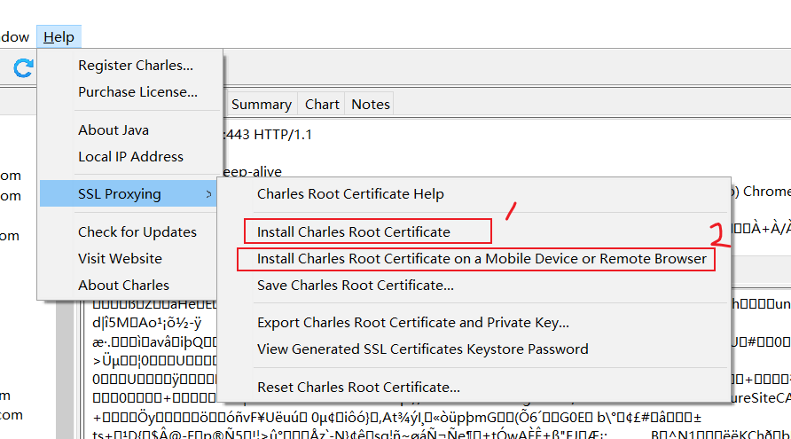

# 003.Charles使用

## 手机使用参考

## 其他

1. 激活
    1. [激活地址](https://www.zzzmode.com/mytools/charles/) 
    2. 
2. 连接代理
    1. 
    2. 
    3. 手机下载一个 postern 
        1. 配置 proxy, 我这里使用 socks 代理, http 代理我更喜欢 fiddler 
3. 修改设置
    1. 避免乱码
        1. 
        2. 
    2. 安装证书
        1. 
        2. 手机上使用代理,然后访问 chls.pro/ssl 自动下载证书
        3. 注意，安卓7以后应用程序不再信任用户级别的证书
            1. 解决方法
                1. 面具模块 Move Certificates 
                2. 手动移动目录
                    1. 用户证书目录: /etc/security/cacerts
                    2. 系统证书目录: /data/misc/user/0/cacerts-added

<CommentService/>
