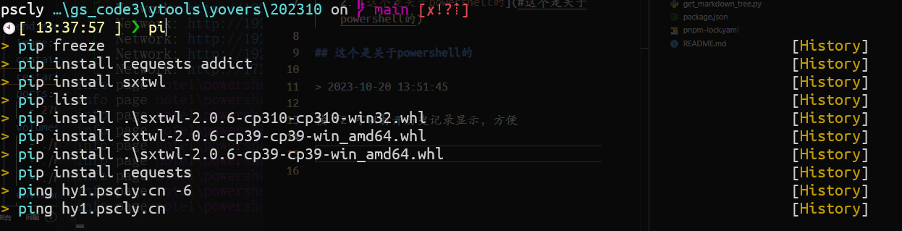

# powershell

## toc

1. [powershell](#powershell)
    1. [toc](#toc)
    2. [这个是关于powershell的](#这个是关于powershell的)
    3. [关于正则](#关于正则)

## 这个是关于powershell的

> 2023-10-20 13:51:45

按 f2 可以打开历史记录显示，方便



## 关于正则

> 2023-10-20 13:54:42

> 我感觉有点小复杂

```powershell
# 通过正则吧 ^\d.*md的文件 复制到 xx 文件夹
ls | Where-Object { $_.Name -match "^\d.*md$" } | foreach { cp $_.FullName "xx" }ls | Where-Object { $_.Name -match "^\d.*md$" } | foreach { cp $_.FullName "xx" }
```

<CommentService/>
