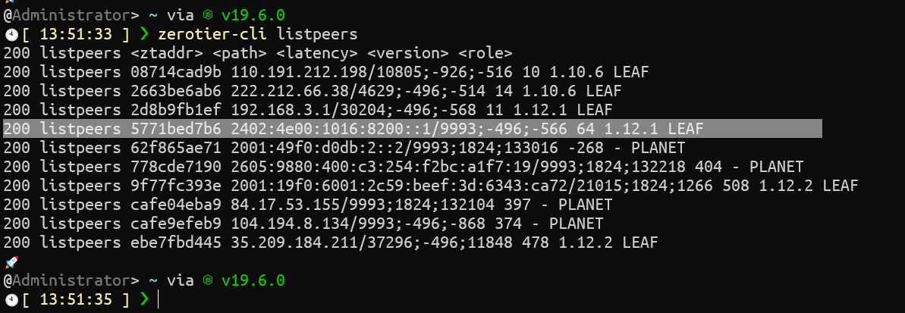

# 1.关于Moon

## toc

1. [1.关于Moon](#1关于moon)
    1. [toc](#toc)
    2. [moon是个子服务器](#moon是个子服务器)
        1. [验证是否安装](#验证是否安装)
    3. [验证2](#验证2)

## moon是个子服务器

客户端安装方法

1. 两种方法
    1. 第一种
        1. 去服务找到 zerotier 的服务
        2. 打开服务所在文件夹
        3. 创建moons.d 文件夹，然后吧服务器创建的 000000xxx.moon考进来
        4. 重启 zerotier 服务
    2. 第二种
        1. 管理员运行 powrshell
        2. ```zerotier-cli orbit xxx xxx```
            1. 例如我这就是 ```zerotier-cli orbit 5771bed7b6 5771bed7b6```

### 验证是否安装

```powrshell
zerotier-cli listpeers
```


## 验证2

```powrshell
zerotier-cli.bat peers
```

<CommentService/>
